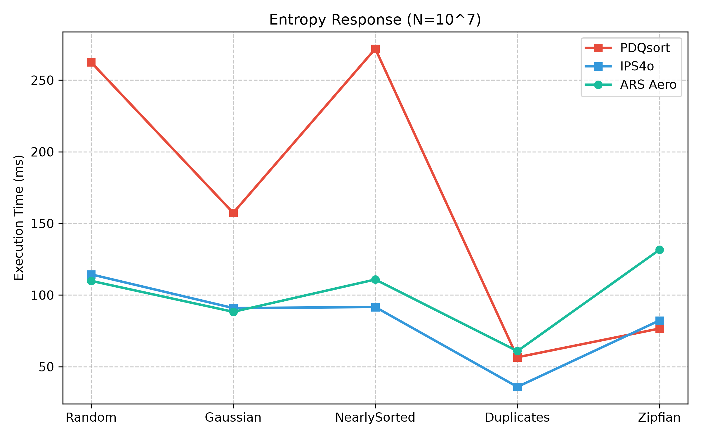

# ARS: Adaptive Range Sorting 🚀

[](https://crates.io/crates/arslib)
[](https://docs.rs/arslib)
[](LICENSE-MIT)

## What is ARS?

`arslib` is a high-performance, cache-friendly, and highly parallel sorting library written in Rust. It implements the **Adaptive Range Sorting (ARS)** algorithm—specifically the 6th Generation "Aero" Architecture and the "Exp D" Streaming Architecture.

Unlike traditional sorting algorithms that rely heavily on branch-intensive decision trees (like Quicksort or PDQsort), ARS treats sorting as a spatial classification problem. It maps elements to a mathematical spatial domain, enabling branchless classification, cache-line-aligned memory writes, and scalable multi-threading.

## Why was it developed?

Modern CPUs process data significantly faster than main memory (DRAM) can serve it. Traditional comparison sorts suffer from two critical physical bottlenecks on modern hardware:

1. **The Branch Misprediction Penalty:** Complex comparison trees cause the CPU pipeline to frequently stall, resulting in wasted cycles.
2. **The Memory Wall:** Fragmented, random memory reads/writes cause high L3 cache misses, bottlenecking throughput on the memory bus.

ARS was engineered specifically to bypass these hardware limitations. By trading a slightly larger memory footprint for a reduction in branch mispredictions, and utilizing write-combining buffers to optimize spatial locality, ARS can saturate memory bandwidth and achieve strong scalability in the evaluated workloads on multi-core systems.

## Paper

For a deep dive into the theoretical framework, algorithmic complexity, and hardware-level performance evaluation of the algorithm, please see the published research paper:

> **[Adaptive Range Sorting: A Hardware-Conscious Spatial Classification Framework](paper/main.pdf)**

## Experimental Evaluation

<p align="center">
  
</p>

- **Throughput**: Outperforms standard library and state-of-the-art sorters (like PDQsort and IPS4o) on multi-core architectures, particularly on large datasets ($N > 10^7$).
- **Distribution Robustness**: The Aero architecture utilizes a cache-resident 1024-entry quantile mapping table to maintain stable latency across skewed distributions (e.g., Gaussian, Zipfian) where linear spatial map functions traditionally fail.
- **Cache-Conscious Memory Movement**: Employs software-managed write-combining buffers, significantly reducing Translation Lookaside Buffer (TLB) pressure and L3 cache thrashing.
- **Streaming Ingestion**: The experimental "Exp D" architecture allows for concurrent, low-latency micro-batching without blocking ingestion pipelines.

## Quick Start

Add `arslib` to your `Cargo.toml`:

```toml
[dependencies]
arslib = "0.4.0"
```

## Examples

### Basic Usage

```rust
use arslib;

fn main() {
    let mut data = vec![5.2, 1.1, 9.8, 3.4, 7.6];

    // Unstable sort (faster)
    arslib::sort(&mut data);
    assert_eq!(data, vec![1.1, 3.4, 5.2, 7.6, 9.8]);

    // Stable sort
    let mut more_data = vec![5, 2, 8, 1, 9, 3];
    arslib::sort_stable(&mut more_data);
    assert_eq!(more_data, vec![1, 2, 3, 5, 8, 9]);
}
```

### Custom Types

To sort your own custom structs, simply implement the `ARSValue` trait. This requires a single method, `to_spatial_u64()`, which projects your type into a 1D uniform numeric space.

```rust
use arslib::ARSValue;

#[derive(Clone, PartialEq, PartialOrd)]
struct Record {
    score: f64,
    id: u32,
}

impl ARSValue for Record {
    fn to_spatial_u64(&self) -> u64 {
        // Map f64 to u64 while preserving sorting order
        self.score.to_spatial_u64()
    }
}

fn main() {
    let mut records = vec![
        Record { score: 95.5, id: 1 },
        Record { score: 42.0, id: 2 },
    ];

    arslib::sort(&mut records);
}
```

## Documentation

For complete API details, check out the documentation on [docs.rs](https://docs.rs/arslib).

## Citation

If you use this software or algorithm in your research, please cite it using the following metadata (or see the `CITATION.cff` and `paper/ars_citation.bib` files in the repository):

```bibtex
@article{ismael2026adaptive,
  title={Adaptive Range Sorting: A Hardware-Conscious Spatial Classification Framework},
  author={Ismael, Mohammad T.},
  year={2026},
  url={https://github.com/Mohammad-Talaat7/arslib},
  note={Preprint / Source Code}
}
```

## License

Licensed under either of

- Apache License, Version 2.0 ([LICENSE-APACHE](LICENSE-APACHE) or http://www.apache.org/licenses/LICENSE-2.0)
- MIT license ([LICENSE-MIT](LICENSE-MIT) or http://opensource.org/licenses/MIT)

at your option.
